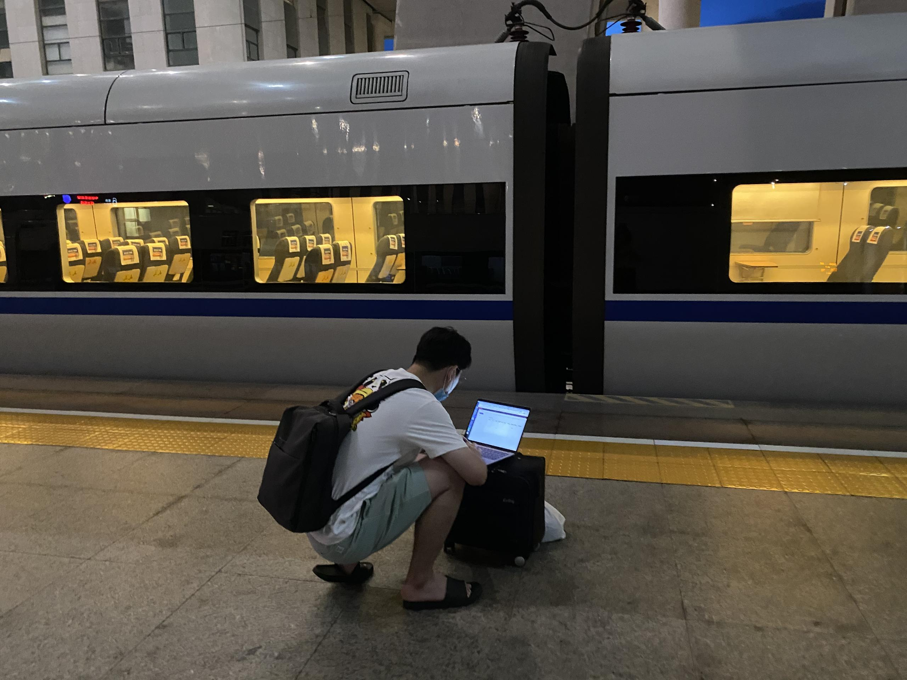
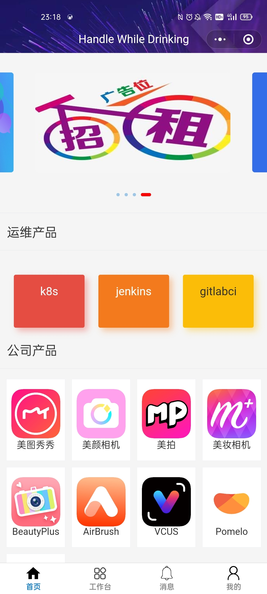
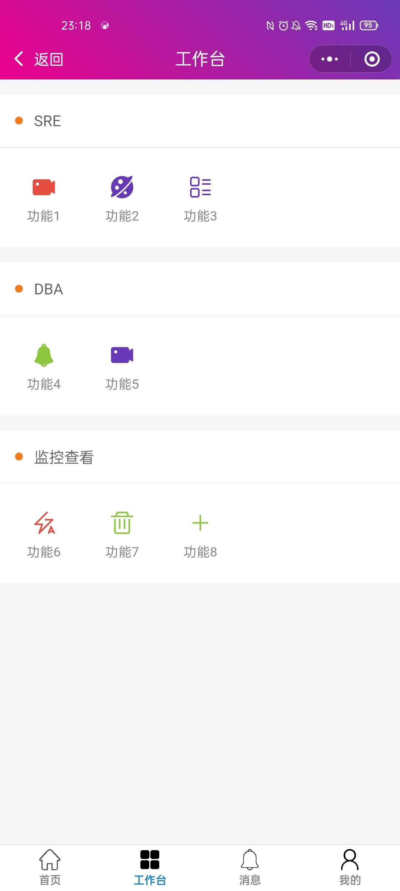
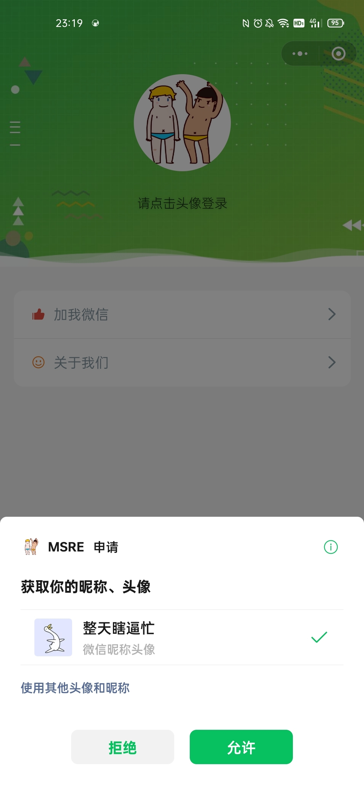
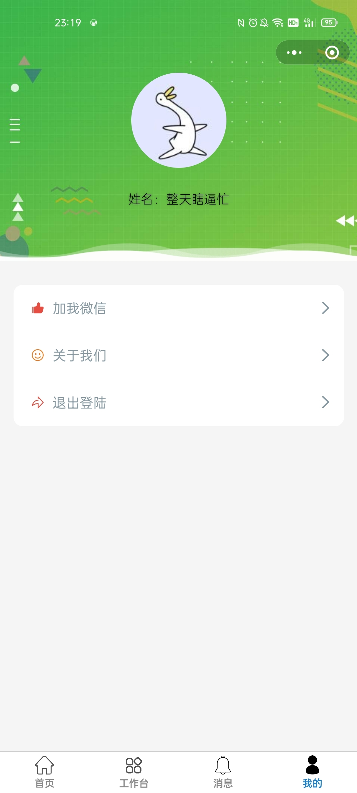
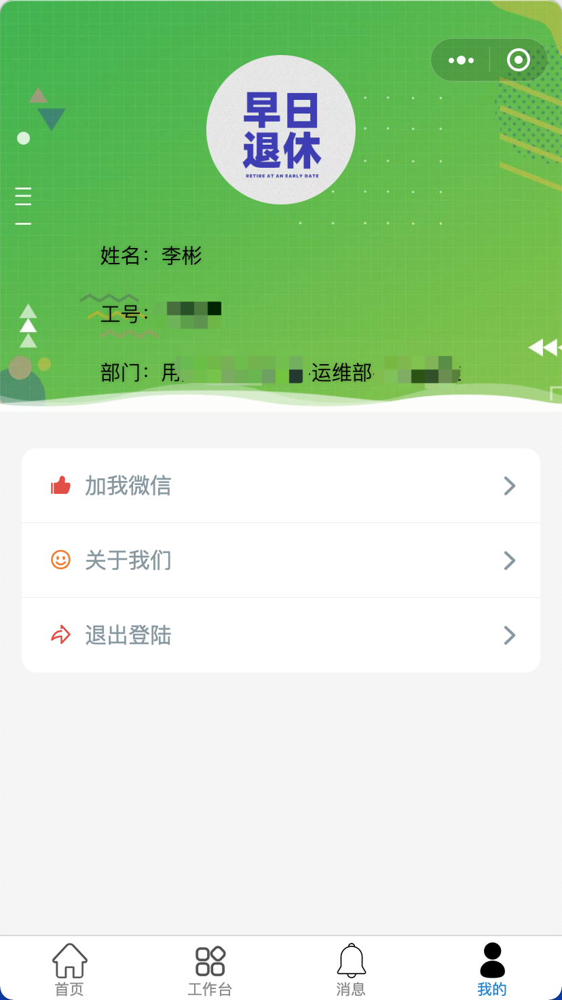
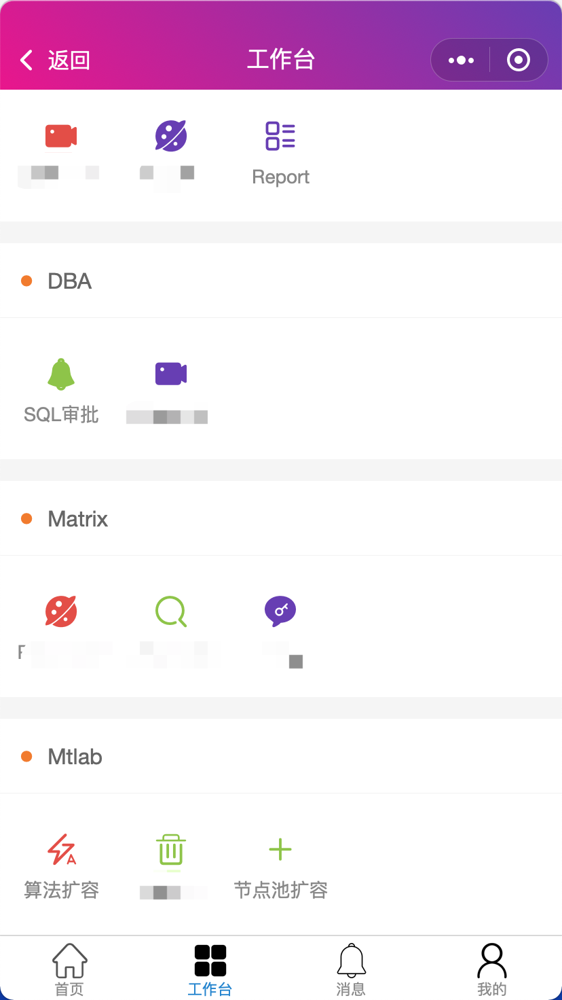

项目介绍
----
对于项目的整体介绍，可以看着个博客，里面介绍了我在移动端运维的工作。[点击我](https://blog.itmonkey.icu/2021/11/14/sre-mobile-tools/)

从项目名字就可以看出来：`在喝酒的时候处理问题`，代表着我经常会在聚餐的时候接到任务，然后处理。
所以我迫切需要一个移动端工具来支撑我这样的需求，让我在聚餐的时候能好好的喝酒。

所以我之前的状态可能是这样的：




项目信息
----

项目分为小程序端和服务端，小程序端就是原生的小程序语言写的，服务端用go写的。整体比较简单，然后我只是实现了登录认证相关功能。
以及前端项目的一个框架设计。

```shell
目录api：服务端项目
目录miniapp/wx：微信登录的小程序代码
目录miniapp/qywx：企业微信登录的小程序代码(由于必须要发布小程序才能绑定企业微信，我就没有测试，代码不难)
```

项目截图
----






如何运行
----

> 小程序端

直接导入到微信开发者工具就可以

> 服务端

```shell
go run main.go
```

依赖
----

服务端依赖redis，主要是用来存储用户session的。


其他说明
----

* 注意权限，由于微信小程序没有什么特别好的权限控制，所以我们直接把小程序转成企业微信小程序了
* 注意安全，我们登录小程序有两道关卡，一你需要是某个企业的员工，二你需要登录公司内部vpn
* 企业认证，小程序最好企业认证，这样可以有不少有用的功能，比如`web-view`
* 配合使用，我们企业微信小程序登录之后会配合公司内部统一登录接口来获取用户信息做一些展示

企业微信小程序
----
下面是我们公司正在使用的企业微信小程序的样子



